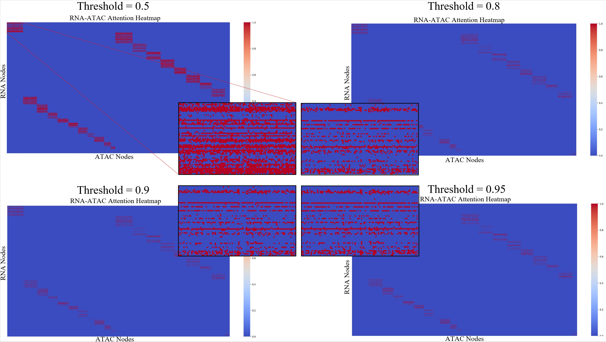
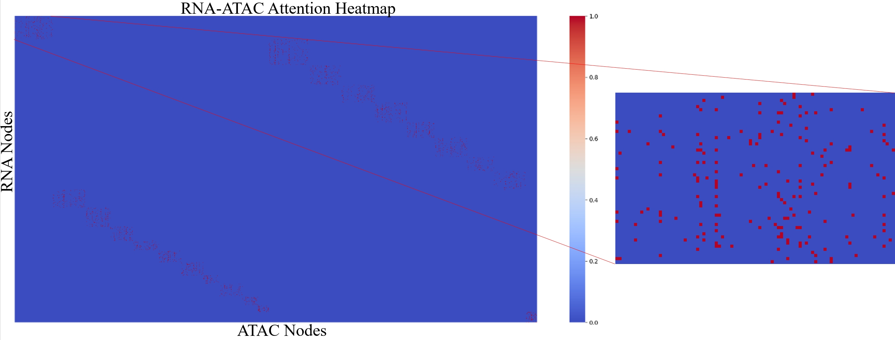
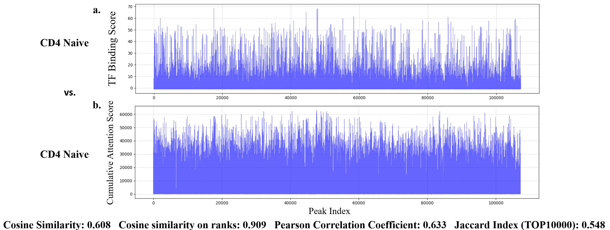
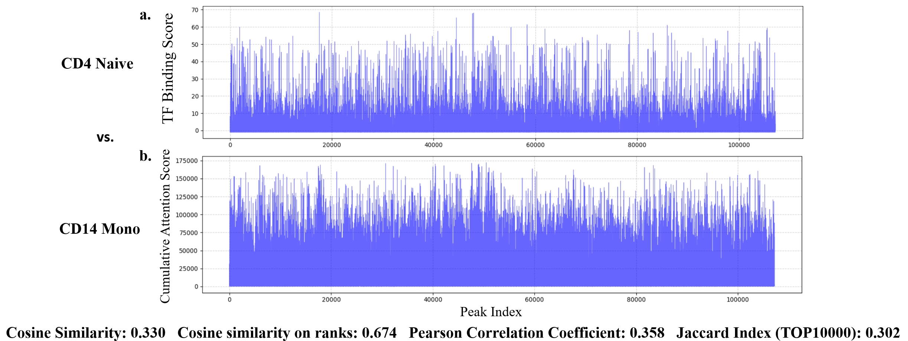

# Learning Crossmodal Interaction Patterns via Attributed Bipartite Graphs for Single-Cell Omics

> This repository is still on progress.

## Graph Construction

Framework of Attribute Bipartite Graphs Construction.

We used four datasets, the original files of the datasets are in “Bi2Former/bio_datasets/{dataset_name}”, and the code for generating the corresponding graph datasets are in “Bi2Former/graph_data_generator_{dataset_name}.py”.

## Bi2Former

Framework of Bi2Former.

The code of our Bi2Former model is in “Bi2Former/model.py”, the training and evaluation code is in “Bi2Former/graph_classification.py”.

# Hyperparameters settings
Experimental results are reported on the hyperparameter settings below, where we choose the settings that achieve the highest performance on the validation set. We choose hyperparameter grids that do not necessarily give optimal performance, but hopefully cover enough regimes so that each model is reasonably evaluated on each dataset.

- learning_rate $\in \{1e-3,5e-4,1e-4,5e-5,1e-5\}$
- weight_decay $\in \{1e-4,5e-5,1e-5,5e-6,1e-6\}$
- dropout $\in \{0,0.1,0.3,0.5,0.8\}$

Bi2Former settings：
- ID embedding dims $\in \{64,128,256,512\}$
- hidden dims $\in \{64,128,256,512\}$
- count of layers $\in \{1,2\}$

# Case of Biological Interpretation and Discovery
## Cell-Level Regulatory Interaction
To further demonstrate the interpretability of \our and its capacity to reveal interaction between ATAC and RNA, we conduct a case study visualizing the learned RNA–ATAC attention matrix under varying threshold settings for a representative single cell. As shown in figure below, increasing the threshold progressively suppresses low-confidence signals, resulting in a sparser attention matrix and more specific and meaningful regulatory signals.

Case study of RNA–ATAC attention matrices for a representative single cell under different threshold values.

However, we observe that without further constraints, some RNA nodes may either lack any activated ATAC connections or remain dense connected—both of which deviate from biological priors. To address this, we introduce a top-k constraint following thresholding. After training with top-k regularization, the model not only achieves better performance but also produces more interpretable attention patterns. As illustrated in figure below, each RNA is regulated by a limited number of ATAC peaks, consistent with known biological principles of gene regulation.

Improved RNA–ATAC interaction map after applying top-k refinement.

## Cell-Type-Level Regulatory Maps
To investigate how ATAC–RNA regulatory patterns vary across cell types, we aggregate ATAC expression signals across cells of the same type and analyze the resulting attention-informed regulatory maps. Specifically, we compute the cumulative attention score as the regulatory strength of each ATAC peak across different cell types to identify cell-type-specific activation patterns. 

To further validate the biological relevance of our model, we compare the cumulative attention scores against experimentally derived TF binding scores, which reflect the actual activation strength of ATAC peaks in each cell type and serve as a proxy for ground truth. The cumulative attention scores for CD4 cells exhibit strong agreement with CD4-specific TF binding signals, indicating that our model successfully identifies biologically meaningful regulatory relationships. In contrast, CD14 cells exhibit different attention profiles relative to the CD4 ground truth, underscoring cell-type-specific regulatory patterns. These results highlight the capacity of our approach to uncover interpretable and biologically grounded crossmodal interactions at the population level.

Comparison between TF binding scores and cumulative attention scores within the same cell type (CD4). The cumulative attention scores produced by our model align closely with the TF binding intensity in CD4 cells, suggesting that the learned crossmodal interactions accurately capture cell-type-specific regulatory signals.

Comparison between TF binding scores from CD4 cells and cumulative attention scores in CD14 cells. CD14 cells exhibit distinct peak activation patterns with the CD4 ground truth, highlighting the distinct regulatory patterns across cell types.

