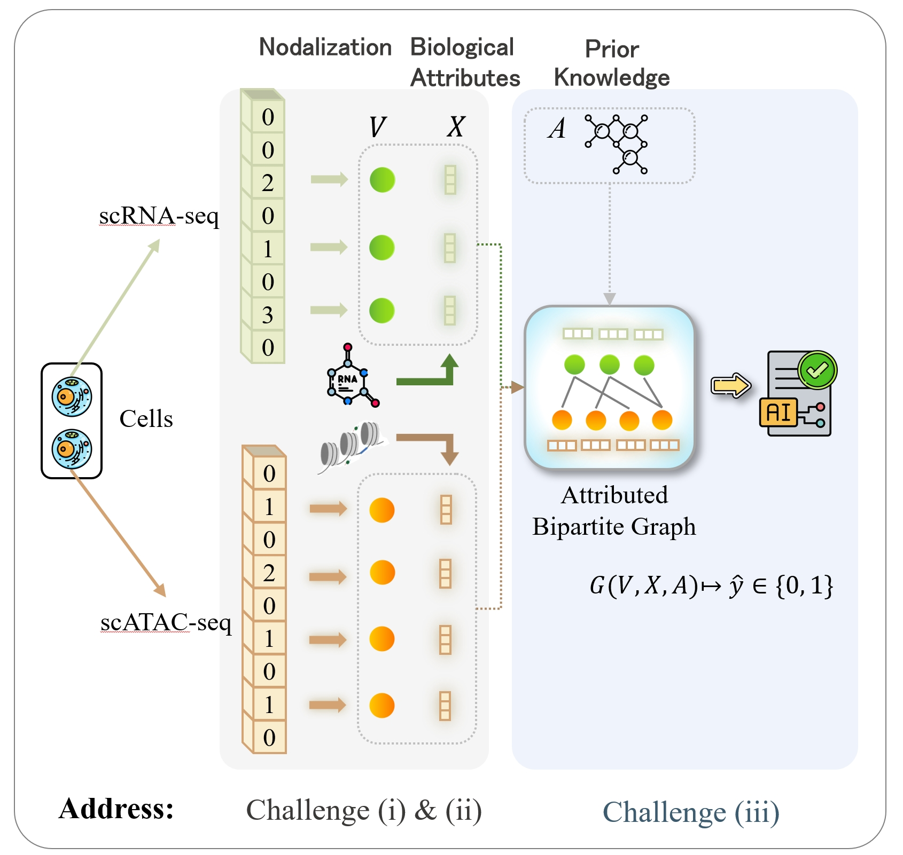
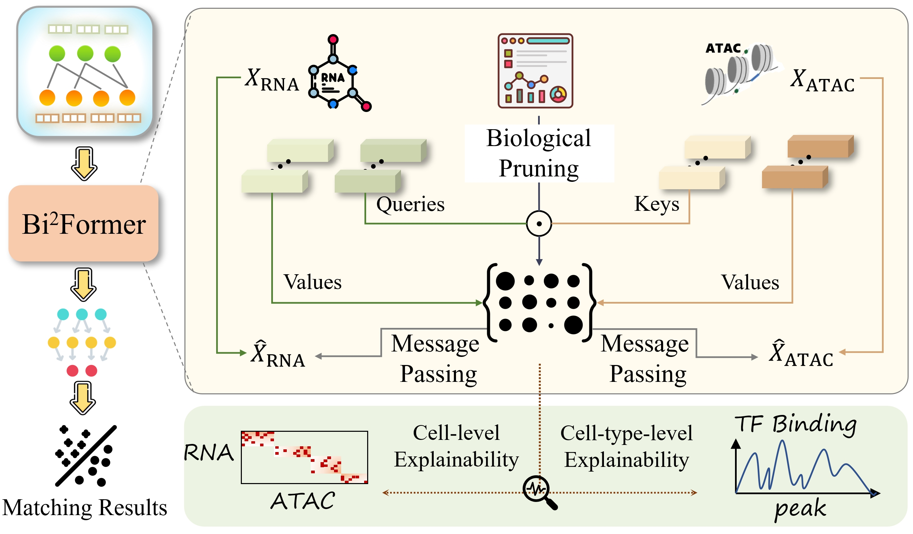

# Learning Crossmodal Interaction Patterns via Attributed Bipartite Graphs for Single-Cell Omics

> This repository is still on progress.

## Graph Construction

Framework of Attribute Bipartite Graphs Construction. 

We used four datasets, the original files of the datasets are in “Bi2Former/bio_datasets/{dataset_name}”, and the code for generating the corresponding graph datasets are in “Bi2Former/graph_data_generator_{dataset_name}.py”.

## Bi2Former

Framework of Bi2Former. 

The code of our Bi2Former model is in “Bi2Former/model.py”, the training and evaluation code is in “Bi2Former/graph_classification.py”.

# Hyperparameters settings
Experimental results are reported on the hyperparameter settings below, where we choose the settings that achieve the highest performance on the validation set. We choose hyperparameter grids that do not necessarily give optimal performance, but hopefully cover enough regimes so that each model is reasonably evaluated on each dataset.

- learning_rate $\in \{1e-3,5e-4,1e-4,5e-5,1e-5\}$
- weight_decay $\in \{1e-4,5e-5,1e-5,5e-6,1e-6\}$
- dropout $\in \{0,0.1,0.3,0.5,0.8\}$

Bi2Former settings：
- ID embedding dims $\in \{64,128,256,512\}$
- hidden dims $\in \{64,128,256,512\}$
- count of layers $\in \{1,2\}$

